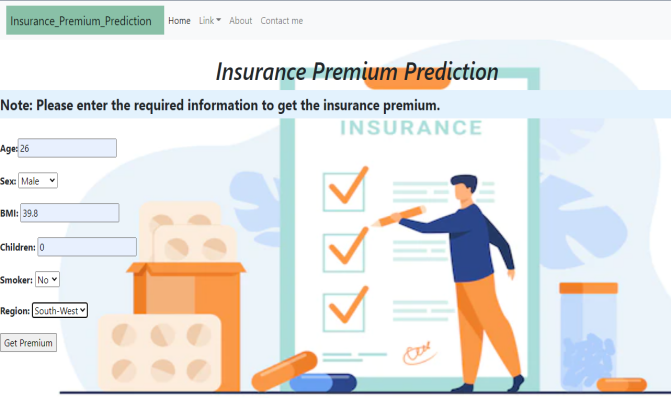

# Insurance Premium Prediction
Built a web application for Insurance Premium Prediction, User will enter the required values & hit Get Premium, and it will show the **premium** as result.

<<<<<<< HEAD
Webapp- https://insurance-premium-webapp.herokuapp.com/
=======
### Webapp-- https://insurance-premium-webapp.herokuapp.com/
>>>>>>> 1a83ffbd04084e03029298aef9e39209bb2760a2

## Overview:
**Title	:**  **Insurance Premium Prediction**  
**Domain :** 	Insurance  
**Tools & Technology :** Python | Data-Preprocessing | EDA | Feature Engineering | Machine Learning | Flask-API | HTML | GitHub | Heroku | AWS  
**ML Algorithms :** Linear Regressor | SVM Regressor | DT Regressor | RF Regressor | Gradient Boosting Regressor | Stacking Regressor  
**IDE :** PyCharm | Google Colab

## Project Description
While taking insurance policy, an individual have to contact an insurance agent or insurance representative and provide required information to reach at the premium for the insurance policy. However, it is hectic and time-consuming process. To fill-up this gap, built this application which allows an individual to insert the required information and get the **Insurance Premium** as result.

## Data
Insurance Premium Prediction is a Machine Learning Algorithms based model. For the Problem statement data collected via Kaggle platform and built an end-to-end deployment ML model. 

## Model Training
After data preprocessing and EDA, came to the conclusion that Age and Smoker are the most significant features which affecting the target/dependent feature. After feature engineering, the performance metrics RMSE, MAE & R2 Score selected. RMSE & MAE to see outlier impact and compare it and R2 Score, since in feature engineering, not creating huge number of new features, hence no impact on target/dependent feature. Built different-different ML models & compared the accuracy with Cross_Validation_Score, found StackingRegressor model as the best model with the cross_validation_score 80.93 %. In addition, with the Hyper-parameters tuning using RandomizedSearchCV, cross_validation_score improved to 83.21% i.e. 2.28% performance increased. 
Saved the best model in pickle file format.

## Model Deployment
After the training part, created a User Interface web application using Flask-API & HTML and deployed the model for productionisation using Heroku & AWS.

## Demo

